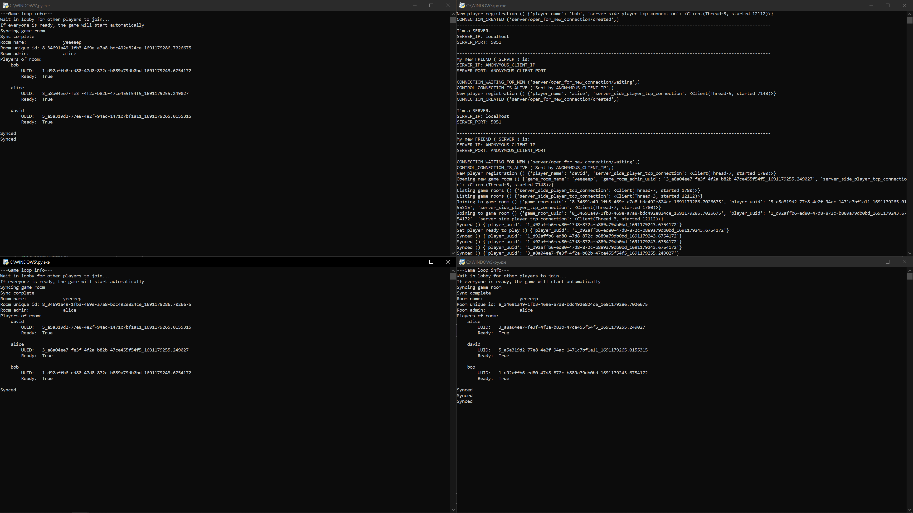

# MultiTurtly - A multiplayer turtle game in Python

MultiTurtly is a Python program family for creating multiple turtles and playing over a network.

## Usage

```
You can create a game room and join it with multiple friends. 
You will also get a turtle and move it around the screen. 
If two turtles collide, your score will increase by one. 
The first player to reach 10 points wins.
```

## Demo images

Working network connections between 3 players.




## Contributing
Pull requests are welcome. For major changes, please open an issue first to discuss what you would like to change.
The project is still in development, it is just for educational purposes.

## Authors
* Benedek Szanyó

## License
[MIT](https://choosealicense.com/licenses/mit/)

## Project status

Project started: _2023. 06. 26._

1st milestone: _2023. 08. 04._ (Game room creation, joining, synchronization)

2nd milestone: _2023. 00. 00._()

Project is: _in development_

## Acknowledgements
* [Turtle](https://docs.python.org/3/library/turtle.html)
* [Socket](https://docs.python.org/3/library/socket.html)
* [Threading](https://docs.python.org/3/library/threading.html)
* Pyconio (by Zoltán Czirkos)
* [Colorama](https://pypi.org/project/colorama/)

## Contact
* Benedek Szanyó - [GitHub](https://github.com/szanyo)

## Project link
* [GitHub](https://github.com/szanyo/MultiTurtly)