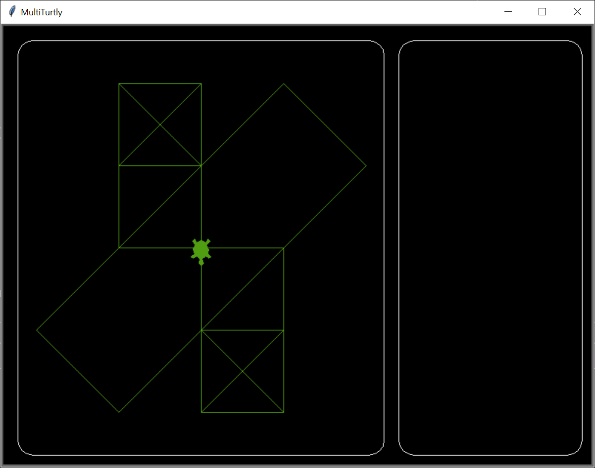

# MultiTurtly - A multiplayer turtle game in Python

MultiTurtly is a Python program family for creating multiple turtles and playing over a network.

## Detailed Description

```
You can create a game room and join it with multiple friends. 
You will also get a turtle and move it around the screen. 
If two turtles collide, your score will increase by one. 
The first player to reach 10 points wins.
```

## Installation

Use the package manager [pip](https://pip.pypa.io/en/stable/) to install the required packages.
(Later I will create a requirements.txt file for this.)

```bash 
Working on this...
```


### Warning!
```
The Server program is only working fully if you register it to the firewall. 
(Unless you do that, you can only play on Loopback interface.)

Do these things before running the server:

- Configurate server.json and client.json files. 
  (If you don't find them, run the server and client once, and they will be created.)
  
- Give full accesspath of the program's .exe file in the firewall settings. (\runnable folder)
    OR 
  if you are running the .py files, give full accesspath of the python.exe file. (Not recommended, because it is not safe.)
  
- Enable

- Both ways

- TCP and UDP

- Other settings are would be any, not specific.
```

#### Configurate the server.json and client.json files
```
- "server_ip": The IP address of the server. (If you leave it empty, it will be your loopback interface.)
 
- "server_port": The port of the server. (If you leave it empty, it will be 5051.)

- "salt": The salt of the network encryption. (I recommend to leave it as it is, if you don't know what it is.)
  (Salt must be the same on the server and the client side.)
  
- "password": The password of the network encryption. (I hardly recommend to change it.)
  (Password must be the same on the server and the client side.)
  
- "log": The logger switch.
```

## Demo images

Working network connections between 3 players.


Demo outlook of the game.


And the working graphical user interface with 3 players. yeeeeah!


Some improvements in the GUI. (Resizeable window, better colors, layout, etc.)




## Contributing
Pull requests are welcome. For major changes, please open an issue first to discuss what you would like to change.
The project is still in development and it is just for educational purposes.

## Authors
* Benedek Szanyó

## License
[MIT](https://choosealicense.com/licenses/mit/)

## Project status

Project started: _2023. 06. 26._

1st milestone: _2023. 08. 04._ (Game room creation, joining, synchronization)

2nd milestone: _2023. 08. 07._ (Working graphical interface with 3 players)

3rd milestone: _2023. 08. 12._ (Tested on LAN, on WAN, firewall settings, some bugfixes)

4th milestone: _2023. 08. 18._ (Gui improvements, resizeable window, better colors, layout, etc.

5th milestone: _2023. 0. 0._ (Gameplay, score, winner)

Project is: _in development_

## Acknowledgements
* [Turtle](https://docs.python.org/3/library/turtle.html)
* [Socket](https://docs.python.org/3/library/socket.html)
* [Threading](https://docs.python.org/3/library/threading.html)
* Pyconio (by Zoltán Czirkos - MIT License)
* [Colorama](https://pypi.org/project/colorama/)

## Contact
* Benedek Szanyó - [GitHub](https://github.com/szanyo)

## Project link
* [GitHub](https://github.com/szanyo/MultiTurtly)